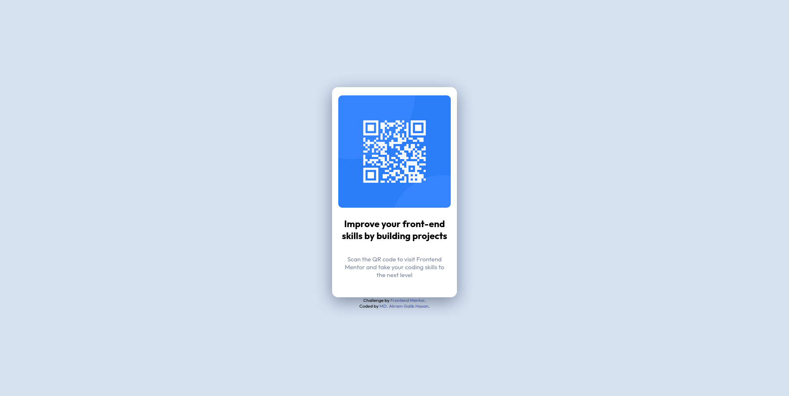

# Frontend_Mentor_Qrcode_Solution  
This is a solution to the [Frontend Mentor QR Code Component Solution](https://www.frontendmentor.io/challenges/qr-code-component-iux_sIO_H). [Frontend Mentor](https://www.frontendmentor.io/) helps developers and newbies to hone their web development skills.
## Table of contents
- [Overview](#overview)
  - [Screenshots](#screenshots)
- [Links](#links)
- [My process](#my-process)
- [Author](#author)
## Overview
Desktop View  

Mobile view  

## Links
**Frontend Mentor QR Code Component Problem LInk:** [https://www.frontendmentor.io/challenges/qr-code-component-iux_sIO_H](https://www.frontendmentor.io/challenges/qr-code-component-iux_sIO_H)  
**Github Solution LInk:** [https://github.com/AkramGalib/Frontend_Mentor_Qrcode_Solution.git](https://github.com/AkramGalib/Frontend_Mentor_Qrcode_Solution.git)  
**Live Site LInk:** [https://akramgalib.github.io/Frontend_Mentor_Qrcode_Solution/](https://akramgalib.github.io/Frontend_Mentor_Qrcode_Solution/)
## My Process
I've used HTML & CSS to solve the problem. As a newbie, I try to solve this problem as simple as possible. There are many mistakes and errors. Let me know that.
## Author
MD. Akram Galib Hasan  
[Github](https://github.com/AkramGalib)       |     [Frontend Mentor](https://www.frontendmentor.io/profile/AkramGalib)     |               [facebook](https://www.facebook.com)/mohammadakramgalib.hasan/)
# Qr-interface
# Solved by Shadhin
